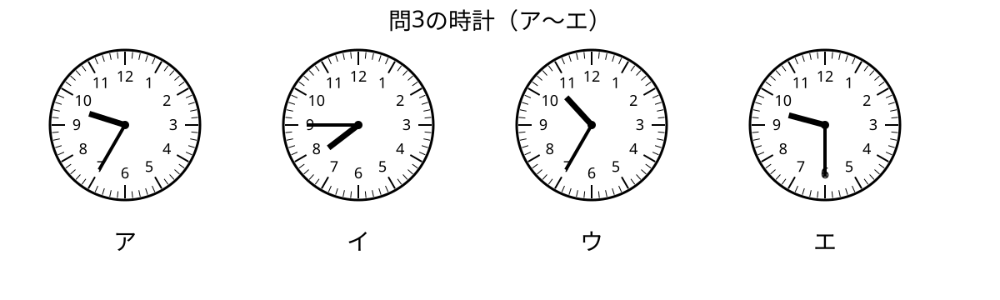

# 調理実習の買い出しスケジュール

2年1組は調理実習で使う材料を買いに行きます。次の表を見て、あとの問いに答えましょう。

| 時刻 | 行く場所・すること | 交通手段や注意点 |
|---|---|---|
| 8:30 | 家庭科室に集合 | ※エプロン・三角巾・買い物メモを確認する |
| 8:45 | 材料リストの確認 | 班ごとに買う物を分担する |
| 9:10 | 学校を出発 | 『バス』に乗る。列に並んで静かに待つ |
| 9:35 | スーパーに到着して買い物 | 値段と数量をメモする |
| 10:15 | スーパーを出発 | 『バス』で学校へ戻る |
| 10:40 | 家庭科室で調理開始 | 手洗いをしてから作業を始める |

## 問題

**【問1：情報の抽出】**  
集合時に確認する持ち物として、表に書かれているものを1つ答えなさい。

**【問2：時間の計算】**  
学校を9:10に出発して、スーパーに9:35に着きました。かかった時間は何分ですか。

**【問3：時計の読み】**  
スーパーに到着する時刻を表している時計を、次のア〜エから1つ選びなさい。

- ア
- イ
- ウ
- エ

**【問4：マナー・知識】**  
『バス』を待つときの行動として、もっともよいものを1つ選びなさい。

- ア：友だちと広がって道をふさぐ
- イ：順番を守って列に並び、静かに待つ
- ウ：先に乗るために前へ割りこむ
- エ：荷物を通路に置いたままにする

## 解答と解説

- **問1 正解例：** エプロン（三角巾、買い物メモでもよい）  
  **ポイント：** ※の注釈に持ち物がまとめて書かれています。

- **問2 正解：** 25分  
  **ポイント：** 9:10から9:30まで20分、さらに9:35まで5分なので、合計25分です。

- **問3 正解：** ア  
  **ポイント：** 9時35分は、長針が「7」、短針が9と10の間にあります。

- **問4 正解：** イ  
  **ポイント：** 公共の乗り物では、順番を守り、まわりの人のじゃまをしないことが大切です。
